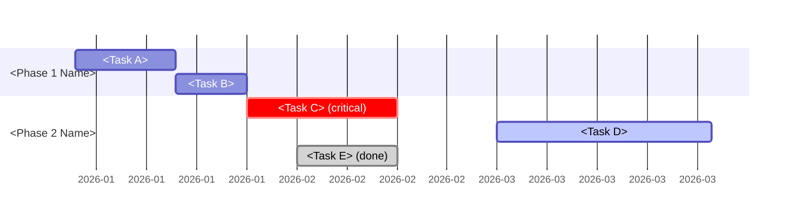
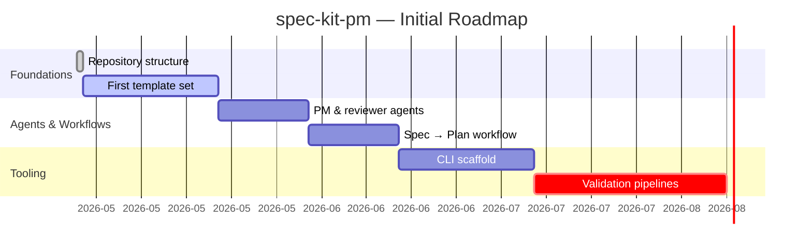

# Gantt Chart — Specification & Template

## Convention

Gantt charts in this project **must** be authored in [Mermaid](https://mermaid.js.org/) using the [`gantt`](https://mermaid.js.org/syntax/gantt.html) diagram type.

**Why Mermaid:**

- Plain-text, diff-friendly, reviewable in pull requests
- Renders natively in GitHub, GitLab, and most Markdown viewers
- AI agents can generate, read, and update it without binary tooling
- No external image files or proprietary editors required

**Do not** use:

- Image exports from MS Project, ProjectLibre, GanttProject, or similar
- Screenshots of spreadsheet timelines
- Embedded binary diagrams

## Required Elements

Every Gantt chart in this repository should include:

1. `title` — what the timeline represents
2. `dateFormat` — explicit, ISO-style (`YYYY-MM-DD`) preferred
3. At least one `section` grouping related tasks
4. Stable task IDs for tasks referenced by `after` dependencies
5. Status markers (`done`, `active`, `crit`) where applicable

## Template

````markdown

````

## Rendered Example



## References

- Mermaid project: <https://mermaid.js.org/>
- Gantt syntax reference: <https://mermaid.js.org/syntax/gantt.html>
- Live editor: <https://mermaid.live/>
